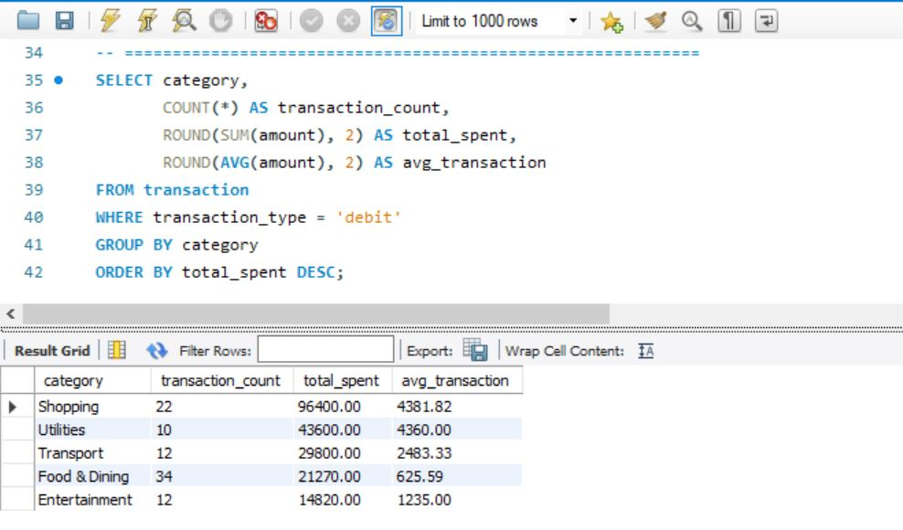
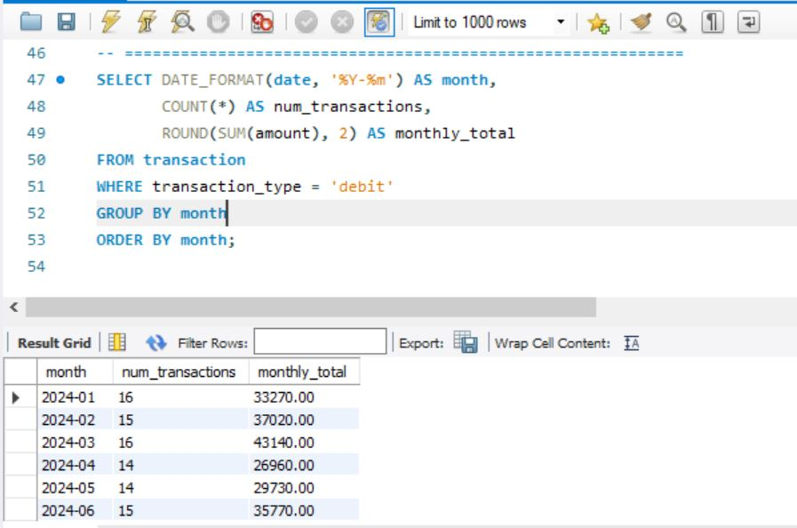
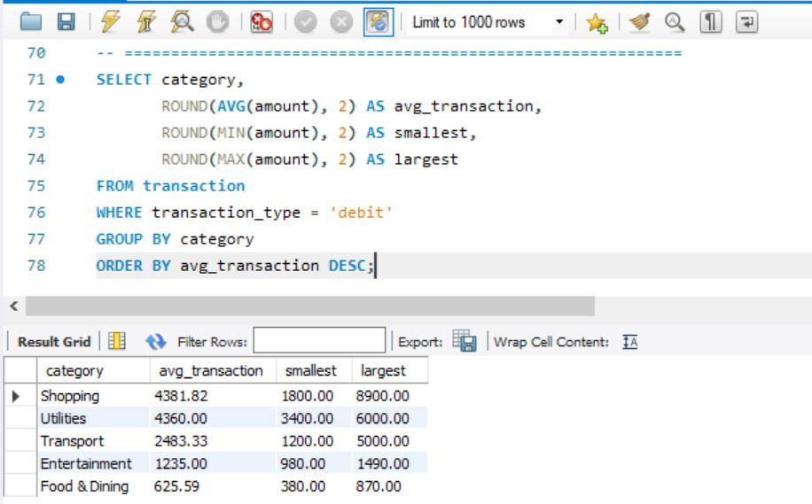
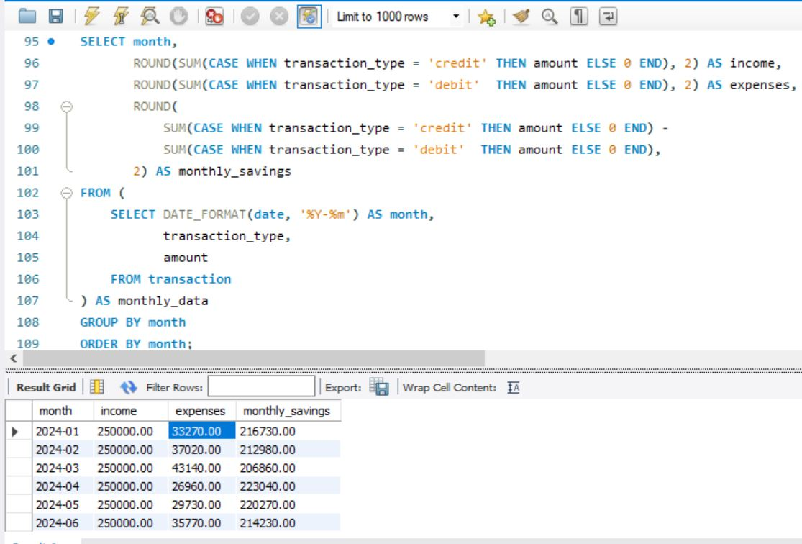
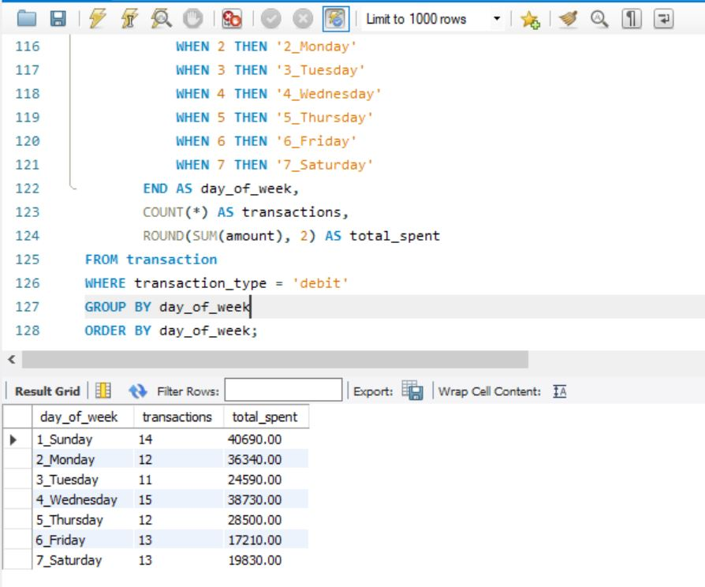
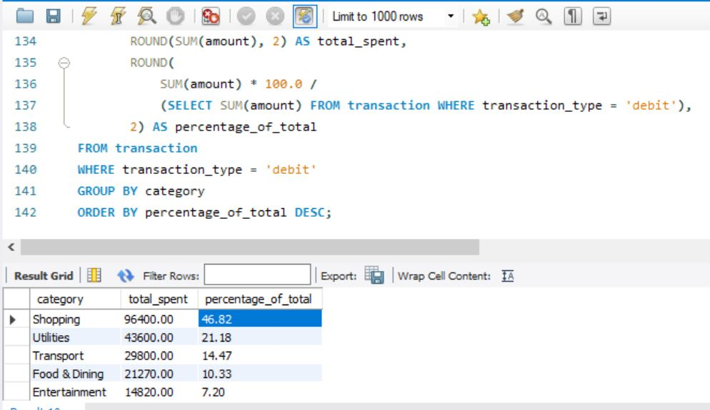

# 🏦 Bank Transaction Analyzer

A beginner SQL project analyzing personal bank transaction data to uncover spending patterns, monthly trends, and top expense categories.

> **Tools used:** SQL · SQLite · DB Browser for SQLite  
> **Dataset:** [Bank Transaction Dataset — Kaggle](https://www.kaggle.com/datasets/valakhorasani/bank-transaction-dataset-for-fraud-detection)  
> **Author:** Ishtiaque Rahman Wasee · Tokyo International University, DBI Major  

---

## 📌 Project Overview

This project explores a bank transactions dataset using SQL queries to answer real business questions:

- Where is most money being spent?
- Which months have the highest spending?
- Who are the top merchants by transaction volume?
- What is the average transaction size by category?

---

## 📁 Repository Structure

```
bank-transaction-analyzer/
│
├── data/
│   └── transactions.csv          # Source dataset
│
├── queries/
│   └── analysis_queries.sql      # All SQL queries used in analysis
│
├── images/
│   └── analysis_1.JPG … analysis_8.JPG  # Screenshots of each query's results
│
└── README.md
```

---

## 🔍 Key Findings









- 🛍️ **Shopping** accounted for the largest share of spending at **46.82%** (¥96,400 across 22 transactions, avg ¥4,381.82/transaction)
- 📅 **March 2024** had the highest monthly spending at **¥43,140** across 16 transactions
- 🏪 Top merchant by both spend and visits was **Amazon Japan** — ¥23,700 across 7 visits
- 💴 Average transaction size across all categories was **¥2,287.67** (90 debit transactions totaling ¥205,890)
- 📆 **Sunday** was the highest-spending day of the week — ¥40,690 across 14 transactions
- 💰 Best savings month was **April 2024**: ¥223,040 saved (¥250,000 income − ¥26,960 expenses)
- 🧾 Largest single transaction was **¥8,900 at Zara** on 2024-02-12

---

## 🗂️ SQL Queries

### 1. Total Spending by Category
```sql
SELECT category, 
       COUNT(*) AS transaction_count,
       ROUND(SUM(amount), 2) AS total_spent
FROM transactions
GROUP BY category
ORDER BY total_spent DESC;
```

### 2. Monthly Spending Trend
```sql
SELECT strftime('%Y-%m', date) AS month,
       ROUND(SUM(amount), 2) AS monthly_total
FROM transactions
GROUP BY month
ORDER BY month;
```

### 3. Top 5 Merchants by Volume
```sql
SELECT merchant, 
       COUNT(*) AS visits,
       ROUND(SUM(amount), 2) AS total_spent
FROM transactions
GROUP BY merchant
ORDER BY total_spent DESC
LIMIT 5;
```

### 4. Average Transaction Size by Category
```sql
SELECT category,
       ROUND(AVG(amount), 2) AS avg_transaction
FROM transactions
GROUP BY category
ORDER BY avg_transaction DESC;
```

### 5. Largest Single Transactions
```sql
SELECT date, merchant, category, amount
FROM transactions
ORDER BY amount DESC
LIMIT 10;
```

---

## 🛠️ How to Run This Project

1. Install [DB Browser for SQLite](https://sqlitebrowser.org/) (free)
2. Open DB Browser → Import `data/transactions.csv` as a new table named `transactions`
3. Open `queries/analysis_queries.sql` and run each query
4. Screenshot your results and save to the `images/` folder

---

## 📚 What I Learned

- Writing SQL queries using `SELECT`, `GROUP BY`, `ORDER BY`, `LIMIT`
- Using aggregate functions: `SUM()`, `COUNT()`, `AVG()`, `ROUND()`
- Using `strftime()` to extract month from date fields in SQLite
- Structuring a data project for GitHub

---

## 🔮 Next Steps

- [ ] Add Python visualizations using Pandas + Matplotlib
- [ ] Connect SQLite to Jupyter Notebook via `pd.read_sql()`
- [ ] Expand analysis with a fraud detection angle

---


