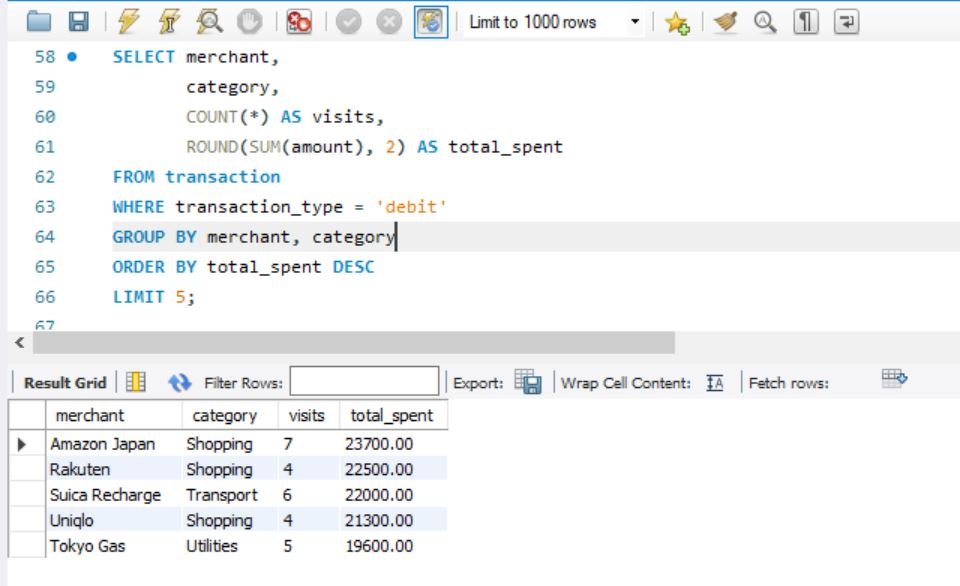
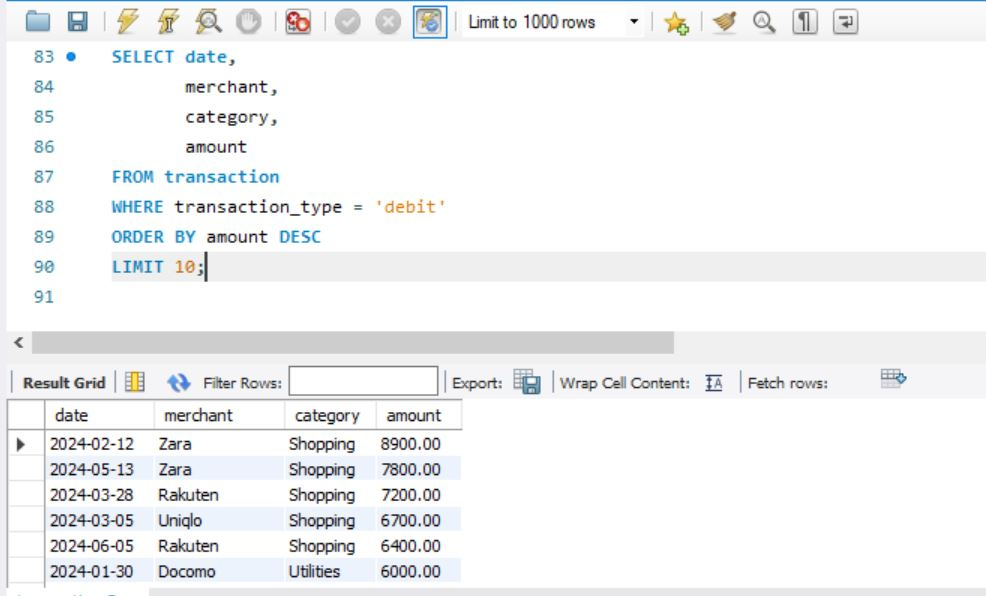

# 🏦 Bank Transaction Analyzer

A beginner SQL project analyzing personal bank transaction data to uncover spending patterns, monthly trends, and top expense categories.

> **Tools used:** SQL · SQLite · DB Browser for SQLite  
> **Dataset:** [Bank Transaction Dataset — Kaggle](https://www.kaggle.com/datasets/valakhorasani/bank-transaction-dataset-for-fraud-detection)  
> **Author:** [Ishtiaque Rahman Wasee] · Tokyo International University, DBI Major  

---

## 📌 Project Overview

This project explores a bank transactions dataset using SQL queries to answer real business questions:

- Where is most money being spent?
- Which months have the highest spending?
- Who are the top merchants by transaction volume?
- What is the average transaction size by category?

---

## 📁 Repository Structure

```
bank-transaction-analyzer/
│
├── data/
│   └── transactions.csv          # Source dataset
│
├── queries/
│   └── analysis_queries.sql      # All SQL queries used in analysis
│
├── images/
│   └── spending_by_category.png  # Screenshot of key results
│
└── README.md
```

---

## 🔍 Key Findings







> _(Fill these in after running your queries — 3 to 5 bullet points)_

- 💳 **Food & Dining** accounted for the largest share of spending at **X%**
- 📅 **Month X** had the highest total transactions at **¥X,XXX**
- 🏪 Top merchant by transaction count was **[Merchant Name]**
- 💴 Average transaction size was **¥X,XXX** across all categories

---

## 🗂️ SQL Queries

### 1. Total Spending by Category
```sql
SELECT category, 
       COUNT(*) AS transaction_count,
       ROUND(SUM(amount), 2) AS total_spent
FROM transactions
GROUP BY category
ORDER BY total_spent DESC;
```

### 2. Monthly Spending Trend
```sql
SELECT strftime('%Y-%m', date) AS month,
       ROUND(SUM(amount), 2) AS monthly_total
FROM transactions
GROUP BY month
ORDER BY month;
```

### 3. Top 5 Merchants by Volume
```sql
SELECT merchant, 
       COUNT(*) AS visits,
       ROUND(SUM(amount), 2) AS total_spent
FROM transactions
GROUP BY merchant
ORDER BY total_spent DESC
LIMIT 5;
```

### 4. Average Transaction Size by Category
```sql
SELECT category,
       ROUND(AVG(amount), 2) AS avg_transaction
FROM transactions
GROUP BY category
ORDER BY avg_transaction DESC;
```

### 5. Largest Single Transactions
```sql
SELECT date, merchant, category, amount
FROM transactions
ORDER BY amount DESC
LIMIT 10;
```

---

## 🛠️ How to Run This Project

1. Download the dataset from the Kaggle link above
2. Install [DB Browser for SQLite](https://sqlitebrowser.org/) (free)
3. Open DB Browser → Import the CSV as a new table named `transactions`
4. Open `queries/analysis_queries.sql` and run each query
5. Screenshot your results and save to the `/images` folder

---

## 📚 What I Learned

- Writing SQL queries using `SELECT`, `GROUP BY`, `ORDER BY`, `LIMIT`
- Using aggregate functions: `SUM()`, `COUNT()`, `AVG()`, `ROUND()`
- Using `strftime()` to extract month from date fields in SQLite
- Structuring a data project for GitHub

---

## 🔮 Next Steps

- [ ] Add Python visualizations using Pandas + Matplotlib
- [ ] Connect SQLite to Jupyter Notebook via `pd.read_sql()`
- [ ] Expand analysis with a fraud detection angle

---


